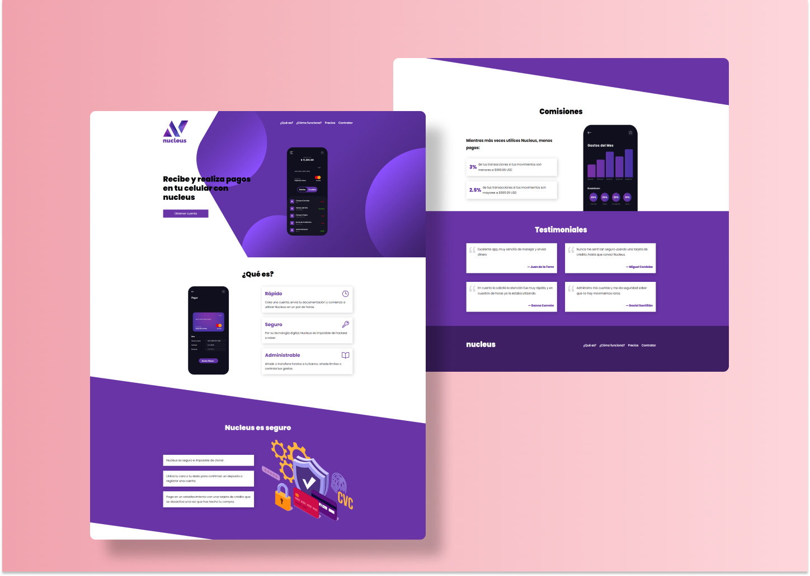

# Nucleus &mdash; LandingPage 💳



Nucleus is a fictional credit card that pretends to offer the best services at market. I developed this project following BEM methodology and mobile first principle. It has a lot of animations and transitions. Each section is easy to understand and tries to draw the user's attention. it is completely responsive and it demostrates my ability to make real a good design like this one.

## Technologies and services used:

  * HTML5
  * CSS3 ( Flexbox and CSS Grid )
  * BEM methodology
  * Netlify


You can check its functionality in:
```
https://nucleussrsn.netlify.app/
```

## UI Considerations
Colors used:

  * Primary: #6834a6
  * Primary-2: #3e1f64
  * Black: #000000
  * White: #ffffff
  
Breaking Points:

It's important to mention that this project was developed based on "mobile first" methodology.

  * Phones and Tablets: 600px
  * Desktop: 900px